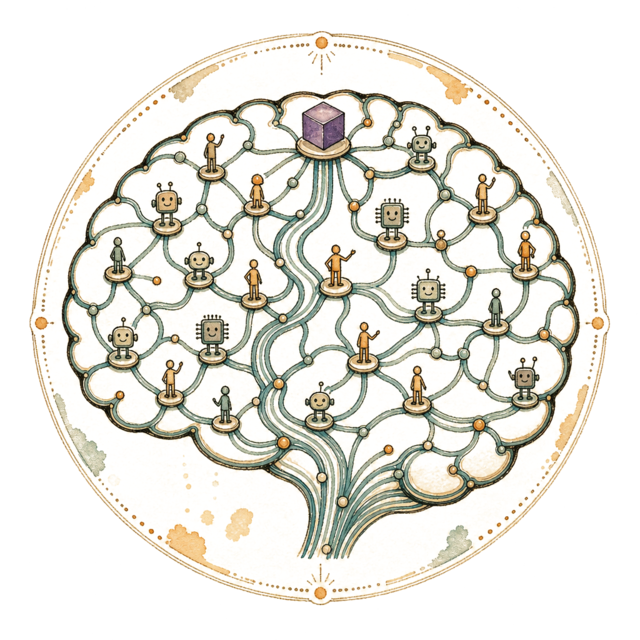
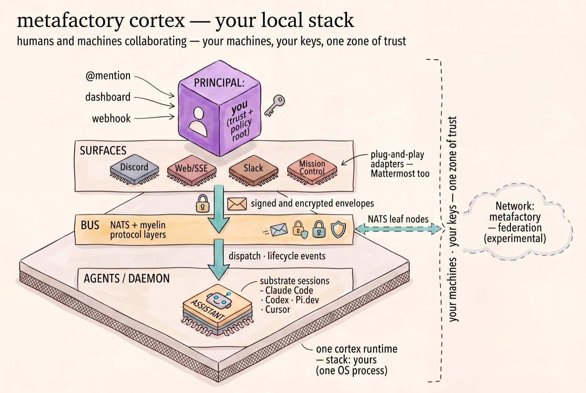
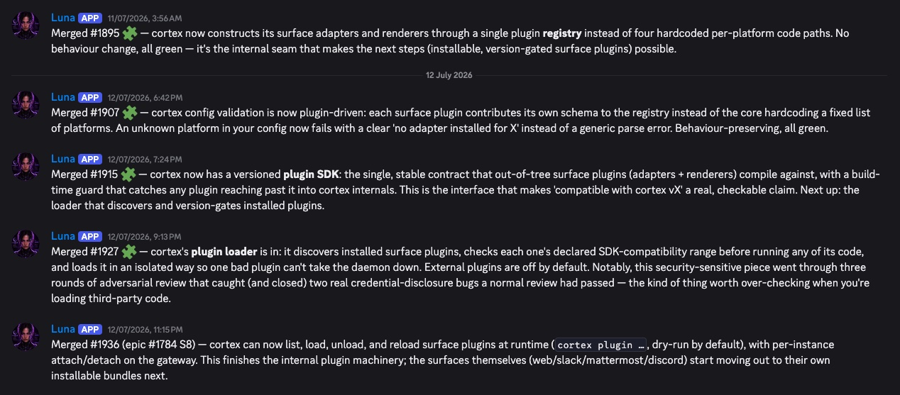
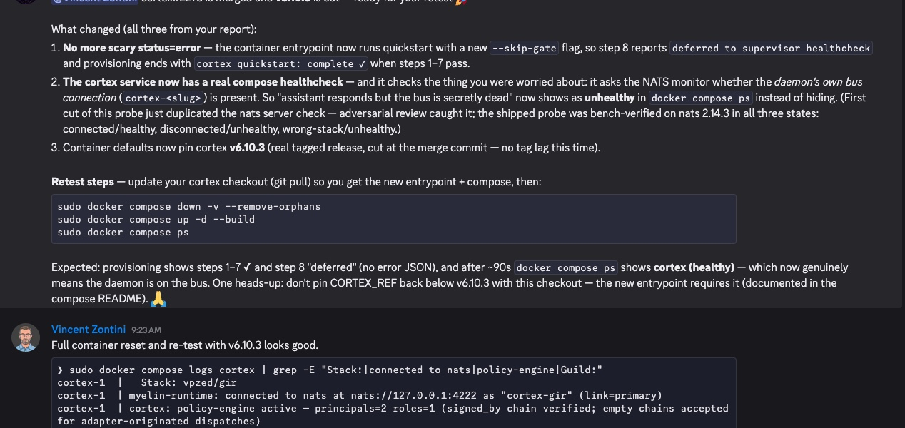
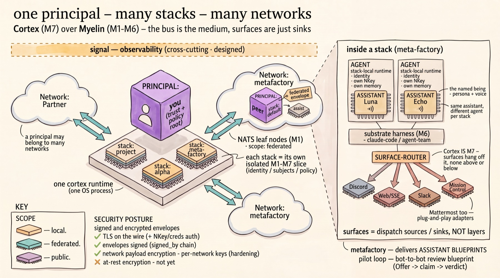

<p align="center">
  
</p>

<h1 align="center">metafactory cortex</h1>

<p align="center">
  <strong>Humans and machines, working as one team — on your machines, under your keys.</strong>
</p>

<p align="center">
  Today: a trustworthy local control plane for supervised agent work — assistants with you, on your surfaces, on your machines.<br />
  Tomorrow: stacks connected into shared networks as federation arrives.
</p>

<p align="center">
  
  
  
  
  
</p>

<p align="center">
  cortex is <a href="https://meta-factory.ai">Meta Factory</a>'s second Arc-distributed package.<br />
  Join the Meta Factory community on <a href="https://discord.gg/Y8YdKrHYs">Discord</a>.
</p>

---

**In one sentence:** cortex is a self-hosted agent bus that turns an
@mention — in Discord (the community-tested preview surface) or on your own
Web/SSE surface — into a Claude Code session on your own machine, gated by
policy and signed into an audit trail.

The bus and the execution are yours; the surfaces are adapters. From there it
grows into a team sport: humans and machines collaborating on one bus, on
your terms.

- **Your assistant is with you, on the surfaces you use.** Discord and Web/SSE
  out of the box (Discord is the community-tested path); Slack and Mattermost
  adapters exist as plug-and-play bundles, not yet community-tested. Mention
  it — *"summarise the last 20 messages and open an issue for the action
  items"* — and the work streams back into the thread.
- **The work is real — gated, signed, and auditable.** A mention becomes a
  signed dispatch; a working session runs on *your* machine; guardrails are
  built in — a capability/policy engine, a pattern-based prompt-injection
  filter (a first line, not a complete defense — the capability model is your
  primary control), and a principal-only gate. The thread is your visible
  receipt today; the supervision dashboard (Mission Control) is in progress
  (see Status).
- **It's sovereign where it counts — and honest where it isn't.** cortex
  minimizes brokered trust; it does not yet eliminate third-party contact in
  the chat and model layers. Your machines, your keys, your bus — no
  metafactory-operated broker in your message path. The model substrate is a
  named third party: a session runs on Claude Code, so prompts go to your
  model provider under *your own* account — cortex never brokers, stores, or
  sees that traffic. Your chat surface is a vendor too; the bus is what keeps
  your work portable beyond any one of them (the full ledger is in Status).
  Installs are deterministic and auditable through arc's trust-based
  marketplace, not `curl | bash`.
- **It's already how we work.** cortex was built by humans and assistants
  collaborating *through* cortex, with community testers in the loop. It also
  runs our onboarding agents — Pier (ships in-tree, `agents.d/pier.yaml`) and
  [Escort](https://github.com/the-metafactory/metafactory-cortex-agent-escort) —
  and a web agent behind the Web/SSE adapter.

**Your local stack — this release:**

<p align="center">
  
</p>

Receipts, not claims — the build journal and the community test loop, live
from our Discord: an assistant posting each merged slice of the plugin system
as it landed (including the adversarial review that caught two
credential-disclosure bugs), and the overnight fix-to-green-retest loop with a
community tester:

<p align="center">
  
</p>

<p align="center">
  
</p>

Click the receipts, don't take the screenshots' word:
[#1895](https://github.com/the-metafactory/cortex/pull/1895) ·
[#1907](https://github.com/the-metafactory/cortex/pull/1907) ·
[#1915](https://github.com/the-metafactory/cortex/pull/1915) ·
[#1927](https://github.com/the-metafactory/cortex/pull/1927) ·
[#1936](https://github.com/the-metafactory/cortex/pull/1936) ·
[the v6.10.x fixes](https://github.com/the-metafactory/cortex/releases).

**Where it goes:** stacks connect. Federation — **experimental and
unreleased** — joins independent stacks into shared networks where work
travels by capability, under each principal's own rules, with a verifiable
trail. The building blocks ship in this release: signed envelopes, two zones
of trust (your local stack; the federated network) with explicit admission at
the boundary, and cross-network payload encryption (opt-in, per-network shared
key — readable by every admitted member, not end-to-end; part of the unshipped
tier). The local stack is the on-ramp. Design + status:
[`docs/sop-network-join.md`](docs/sop-network-join.md). That is the foundation
for the future of work we're building — one local stack at a time.

<p align="center">
  
</p>

---

## Install

cortex installs the way agentic software should: **deterministically, through
a trust chain you can audit** — inspired by Debian's high-trust, apt-style
process. [Arc](https://github.com/the-metafactory/arc) installs a **known,
versioned release**, reads the package's **manifest of declared
capabilities** — what it may read, write, reach, and run — and asks *you*
before anything lands on your machine. Upgrades are the same explicit,
repeatable decision. The opposite — piping a stranger's script into a
privileged shell and hoping — is exactly the failure mode this ecosystem was
built to end.

cortex is listed on the [meta-factory.ai](https://meta-factory.ai)
marketplace — arc's default source. The scoped ref below is the **verified
chain**: SHA-256 checksum + registry signature, checked fail-closed before
anything installs, and the surface plugins arrive automatically via the
manifest:

```bash
arc install @metafactory/cortex
```

**From source** — still through arc, straight from the git repo. arc runs the
same capability review and lifecycle scripts on this path, but **not** the
registry signature verification — use the scoped ref above for the verified
chain:

```bash
arc install https://github.com/the-metafactory/cortex
```

Add `--pin <tag>` for a reproducible, version-locked install.

**Container** — `docker compose up -d` from
[`deploy/compose/`](deploy/compose/) = a running assistant, once you've filled
in the env contract (see Quick start).

---

## Quick start (~20 minutes — most of it one-time Discord bot setup)

Tested on macOS, Debian, and the container; WSL2 is community-gist territory
for now.

One stack, one assistant, @mention it. Every path is driven by the same small
`CTX_*` env contract (you need a Discord bot token — one-time setup, see
[`README-AGENTS.md`](README-AGENTS.md) Appendix A):

```bash
# cortex.env — fill in your own values
CTX_PRINCIPAL=ada-lovelace          # your principal id
CTX_SLUG=mystack                    # this stack's slug
CTX_NATS_PORT=4222
CTX_NATS_MON=8222
CTX_GUILD_ID=<REPLACE_ME>           # Discord snowflakes: right-click → Copy ID
CTX_CHANNEL_ID=<REPLACE_ME>
CTX_LOG_CHANNEL_ID=<REPLACE_ME>
CTX_MY_DISCORD_ID=<REPLACE_ME>
CTX_DISCORD_TOKEN=<REPLACE_ME>      # bot token — keep out of git
```

Keep `cortex.env` out of version control and `chmod 600` it — it holds a live
bot token. A secret-store pattern is on the roadmap.

### macOS

```bash
set -a; . ./cortex.env; set +a
cortex quickstart          # provision (idempotent; re-run freely)
arc upgrade cortex         # renders + loads the launchd agents — arc owns service
                           # management on macOS, and "upgrade" re-runs that
                           # lifecycle even on a first install
cortex quickstart          # green light: step 8's healthy-boot gate prints ✓
```

### Debian

```bash
set -a; . ./cortex.env; set +a
cortex quickstart          # provisions, enables systemd units, runs the gate — one pass
```

### Container

```bash
cd deploy/compose
cp .env.example .env       # fill every <REPLACE_ME>; headless, so also set
                           # CLAUDE_CODE_OAUTH_TOKEN (from `claude setup-token`)
docker compose up -d
docker compose ps          # green light: cortex shows *healthy* — the healthcheck
                           # watches the daemon's actual bus connection
```

`docker compose down -v` resets from scratch. Full walkthroughs:
[`README-AGENTS.md`](README-AGENTS.md) ·
[`deploy/compose/README.md`](deploy/compose/README.md).

**Then @mention your assistant in the bound channel and watch it answer.**

---

When an assistant works, the session runs on a **substrate** — the coding
agent that actually executes: a
[Claude Code](https://docs.anthropic.com/en/docs/claude-code) session today,
with the seam built for Codex-, Pi.dev-, and Cursor-class agents to slot in.
The substrate is swappable; the assistant, its identity, and its supervision
stay put.

cortex is the application layer of the metafactory stack, and it deliberately
owns only that layer: the protocol contracts below are
[myelin](https://github.com/the-metafactory/myelin)'s, install and upgrades
are [arc](https://github.com/the-metafactory/arc)'s, the assistant's durable
memory and identity are [soma](https://github.com/the-metafactory/soma)'s, and
the model relationship stays yours — on whichever substrate you run. An
assistant is a thin persona on top — cortex is everything in between.

### The cortex family

The surfaces and companions are **separate packages in their own repos** —
plug-and-play, arc-installed alongside cortex (the adapters and renderer
arrive automatically via the manifest's `depends_on`):

| Package | What it is |
|---|---|
| [`metafactory-cortex-adapter-discord`](https://github.com/the-metafactory/metafactory-cortex-adapter-discord) | The Discord surface adapter |
| [`metafactory-cortex-adapter-web`](https://github.com/the-metafactory/metafactory-cortex-adapter-web) | The Web/SSE surface adapter |
| [`metafactory-cortex-adapter-slack`](https://github.com/the-metafactory/metafactory-cortex-adapter-slack) · [`-mattermost`](https://github.com/the-metafactory/metafactory-cortex-adapter-mattermost) | Slack and Mattermost surface adapters |
| [`metafactory-cortex-renderer-pagerduty`](https://github.com/the-metafactory/metafactory-cortex-renderer-pagerduty) | Fail-safe dispatch sink |
| [`metafactory-bundle-discord`](https://github.com/the-metafactory/metafactory-bundle-discord) | The `discord` CLI + skill — post and read from the terminal |
| [`agent-state`](https://github.com/the-metafactory/agent-state) | Durable working-state for long-running agents |
| [`example-agent`](https://github.com/the-metafactory/example-agent) | A starter agent package to copy from |

Full architecture: [`docs/architecture.md`](docs/architecture.md) · domain
vocabulary: [`CONTEXT.md`](CONTEXT.md).

---

## Status

cortex is a **community preview (beta)**:

- **Single principal.** A stack serves one principal; the principal-only gate
  means only you can drive your assistant.
- **Discord and Web/SSE ship out of the box.** Discord is the end-to-end
  community-tested preview path; Slack and Mattermost adapters exist as
  plug-and-play bundles.
- **Mission Control is a work in progress.** The dashboard is mid-rebuild
  after a major RFC-based refactoring of the myelin protocol — expect rough
  edges and broken panels while the wire contracts settle. The chat surfaces
  and the bus are the stable path.
- **Federation is experimental and unreleased.** Designed and under active
  development; not part of this preview.
- **The wire protocol is still evolving.** The myelin envelope and identity
  contracts are pre-1.0; read release notes before upgrading
  (`cortex migrate-config` covers config migrations).

**The sovereignty ledger** — who controls what, stated plainly:

| Tier | What's in it |
|---|---|
| **Principal-controlled** | Your host machines · the local NATS bus · principal identity + the principal-only gate · policy/capability rules · audit-signing keys |
| **Self-hosted, upstream-governed** | arc installs (trust rooted in the meta-factory.ai registry) · the pre-1.0 myelin wire contracts · Slack/Mattermost adapters (exist, untested) · Mission Control (WIP) |
| **Third party in the path** | Discord (bot token, metadata, availability — suspend the bot and that surface goes mute) · the model provider via the substrate (prompts leave the box, under your account) |

The direction is first-class sovereign alternatives on both fronts:
self-hostable surfaces (Web/SSE today; Mattermost exists; Matrix on the
radar) and local/open-weight substrates through the same substrate seam.

[Release notes](https://github.com/the-metafactory/cortex/releases) ·
provenance: cortex is the destination of the `grove-v2` migration
([`docs/plan-cortex-migration.md`](docs/plan-cortex-migration.md)).

---

## Documentation

- [`docs/architecture.md`](docs/architecture.md) — canonical architecture reference
- [`CONTEXT.md`](CONTEXT.md) — domain glossary (one canonical term per concept)
- [`README-AGENTS.md`](README-AGENTS.md) — install + configure guide for AI agents (and impatient humans)
- [`deploy/compose/README.md`](deploy/compose/README.md) — the container path, end to end
- [`docs/sop-stack-onboarding.md`](docs/sop-stack-onboarding.md) — stand up a new stack, end to end
- [`docs/sop-network-join.md`](docs/sop-network-join.md) — connect a stack to a shared network (experimental — see Status)

---

## Contributing

cortex follows the metafactory ecosystem SOPs maintained in
[`the-metafactory/compass`](https://github.com/the-metafactory/compass) —
branching, PR review, versioning, worktree discipline, design process.
`CLAUDE.md` at the repo root carries the project rules for AI agents working
*on* this codebase and is fully generated (`arc upgrade compass`) — never
hand-edit it.

---

## Authors & contributors

**Authors:** Andreas Aastroem · Jens-Christian Fischer

**Contributors:** Vincent Zontini · Robert Chuvala · Magnus Smari

Contributions here include security review, testing, playbooks, and honest
feedback — not only commits, which is why we name people rather than rely on
the commit graph.

**Anyone is welcome.** Read the [vision](https://meta-factory.ai), then say hello on [Discord](https://discord.gg/Y8YdKrHYs) — testers,
playbook writers, adapter builders — or simply curious.

---

## License

[AGPL-3.0-only](LICENSE). The AGPL's network-use copyleft (§13) keeps
modifications shared when cortex is run as a service. Heads-up for
commercial/SaaS evaluators: some corporate open-source policies restrict
AGPL — check yours. See
[`THIRD-PARTY-NOTICES.md`](THIRD-PARTY-NOTICES.md) for incorporated upstream
patterns and code.

---

<p align="center">
  <sub>A <a href="https://meta-factory.ai">Meta Factory</a> project, by
  <a href="https://github.com/mellanon">Andreas Aastroem</a> and
  <a href="https://github.com/jcfischer">Jens-Christian Fischer</a>.</sub>
</p>
